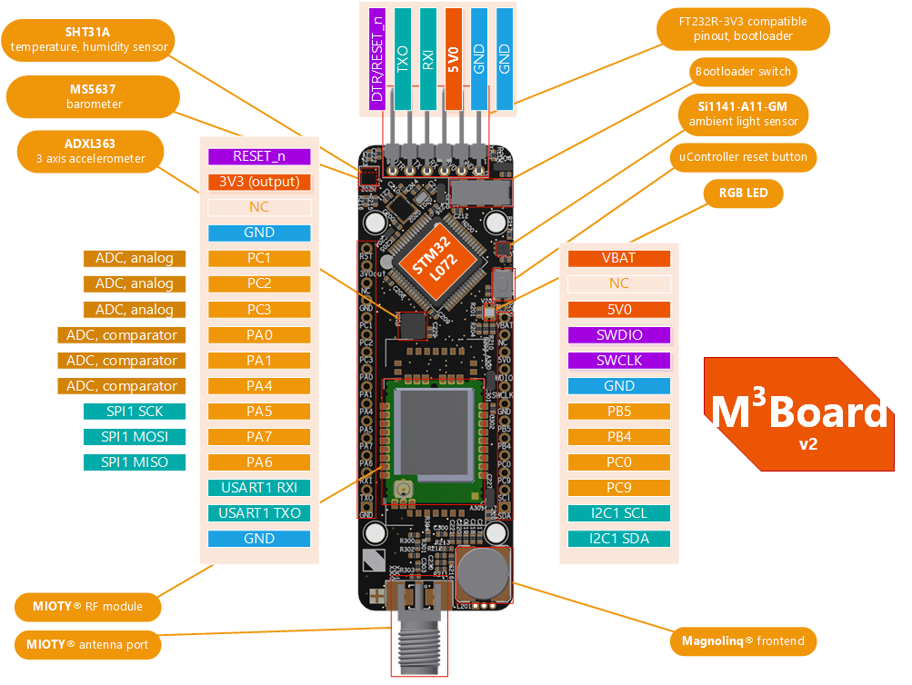

# m3b - Magnolinq-Mioty Demo Board

## Introduction

This repo contains example code for configuring the m3b Demo Board with Arduino IDE.

## Getting Started

1. Install Arduino IDE (tested with v1.8.16)
2. Install [STM32CubeProgrammer](https://www.st.com/en/development-tools/stm32cubeprog.html)
3. Add [stm32duino](https://github.com/stm32duino/wiki/wiki/Getting-Started) to Board Managers (v2.1.0)
4. Add to library manager
    - [ms5637](https://github.com/sparkfun/SparkFun_MS5637_Arduino_Library) (v1.0.1)
    - [sht31](https://github.com/RobTillaart/SHT31) (v0.3.4)
    - [adxl362](https://www.arduino.cc/reference/en/libraries/adxl362/) (v1.5.0)
    - [at_client](https://www.github.com/mioty-iot/mioty_at_client_c)

## Flashing STM32 from Arduino IDE

- Connect Device via UART (e.g. FTDI cable)
- Under Arduino IDE -> Tools:
    - Select Board:             Generic STM32L0 Series
    - Select Board Part Number: Generic L072RBTx
    - Select USART Support:     Enabled (no generic, serial)
    - Select Upload Method:     Stm32CubeProgrammer (Serial)
    - Make sure to select the correct port
- Enable Bootloader mode on the m3b (i.e. shift the bootloader switch & press the uController reset button)
- Upload sketch
- Release the boot switch
- Press reset button to start your sketch

## Hardware




## Mioty Blueprint

The M3B has two payload formats, which are interpreted by a Type Format Description, also called a "blueprint". The following blueprint must be entered in the corresponding Mioty backend (i.e. Application Center, cloud, base station).

```
{
    "version":"1.0",
    "typeEui":"70B3D567700F0100",
    "meta":{
        "vendor":"Fraunhofer Mioty Demonstrator",
        "name":"M3B Sensor"
    },
    "uplink":[{
        "id":0,
        "payload":[
            {"name":"temperature", "type":"uint", "size":16, "func":"$ / 10.0 - 273.15", "unit":"°C"},
            {"name":"humidity", "type":"uint", "size":8, "unit":"%rel"},
            {"name":"pressure", "type":"uint", "size":16, "func":"$ / 10.0", "unit":"hPa"},
            {"name":"luminosity", "type":"uint", "size":16, "func":"$", "unit":""}
        ]
    },
    {
        "id":1,
        "payload":[
            {"name":"temperature", "type":"uint", "size":16, "func":"$ / 10.0 - 273.15", "unit":"°C"},
            {"name":"accel_x", "type":"int", "size":16, "func":"$", "unit":"mG"},
            {"name":"accel_y", "type":"int", "size":16, "func":"$", "unit":"mG"},
            {"name":"accel_z", "type":"int", "size":16, "func":"$", "unit":"mG"}
        ]
    }
    ]
}
```


